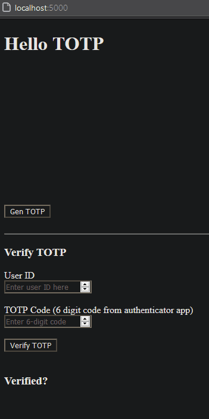

<h3>TOTP</h3>
<h4>Time-based one time password</h4>

	Goal: 
	Generate a QR code that can be scanned with Google authenticator, and stored on the server to use for authentication

<h1>Complete!</h1>

Took about a week to figure everything out. Started looking into creating the HMAC / TOTP URL myself, but using "speakeasy" and "qrcode" packages made this a breeze.

I will still look at generating the code myself in the future, because the speakeasy package is no longer maintained.

<h3>Working Example:</h3>

<strike>
  

    See the live site:
    <a rel="noreferrer" href="#">
      Live Site
    </a>
  

</strike>
